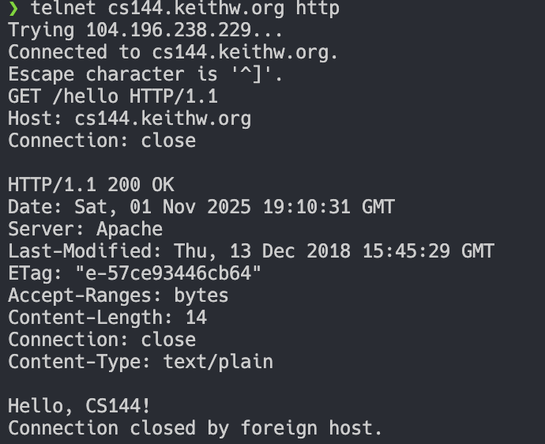

# Computer Network Lab - Check 0

StudentID: 23307110192  
Name: 朱文凯  

## Environments

## Experiment

### Part 1: Networking By Hand

#### Fetch A Web Page



### Listening And Connecting

```bash
# shell 1
❯ netcat -v -l -p 9090
Listening on 0.0.0.0 9090

# shell 2
❯ telnet localhost 9090
Trying 127.0.0.1...
Connected to localhost.
Escape character is '^]'.

# shell 1
Connection received on localhost 63498

# shell 2 send
hello world

# shell 1 receive
hello world

# shell 1 send
hello world too

# shell 2 receive
hello world too

# shell 1 terminated
# shell 2
Connection closed by foreign host.
```

## Part 2: Program Using An OS Stream Socket

### Basic Knowledge

**Stream Socket**: a reliable bidirectional byte stream between two programs  
*most operation systems will provide this feature*  

To the programs, the socket API will be presented as a file descriptor just like file or other common I/O streams  

if two sockets are connected, the bytes written to one socket will eventually come out in the same order from the other socket  

Q1: pipe and socket?  

**TCP**: Transmission Control Protocol  
the guarantee of the correctness of the transmission of the data through Internet  

### Requirements

Using pre-existing support for TCP
program a **webget**  
which creates a TCP stream socket  
connects to a Web server  
and fetches a page  
*(just like what we did in the experiment)*  

### Process

First build prepare:  

```bash
❯ cmake -S . -B build
-- The CXX compiler identification is Clang 16.0.6
-- Detecting CXX compiler ABI info
-- Detecting CXX compiler ABI info - done
-- Check for working CXX compiler: /usr/bin/clang++-16 - skipped
-- Detecting CXX compile features
-- Detecting CXX compile features - done
-- Setting build type to 'Debug'
-- Building in 'Debug' mode.
-- Configuring done
-- Generating done
-- Build files have been written to: /usr/src/myapp/ComputerNetwork/2_Lab/check0/minnow/build

❯ cmake --build build
[ 15%] Building CXX object util/CMakeFiles/util_debug.dir/address.cc.o
[ 15%] Building CXX object tests/CMakeFiles/minnow_testing_debug.dir/common.cc.o
[ 21%] Building CXX object util/CMakeFiles/util_debug.dir/eventloop.cc.o
[ 21%] Building CXX object src/CMakeFiles/minnow_debug.dir/byte_stream.cc.o
[ 26%] Building CXX object apps/CMakeFiles/stream_copy.dir/bidirectional_stream_copy.cc.o
[ 31%] Building CXX object src/CMakeFiles/minnow_debug.dir/byte_stream_helpers.cc.o
[ 36%] Building CXX object util/CMakeFiles/util_debug.dir/file_descriptor.cc.o
[ 42%] Building CXX object util/CMakeFiles/util_debug.dir/ipv4_header.cc.o
[ 47%] Building CXX object util/CMakeFiles/util_debug.dir/random.cc.o
[ 52%] Linking CXX static library libminnow_debug.a
[ 52%] Built target minnow_debug
[ 57%] Building CXX object util/CMakeFiles/util_debug.dir/socket.cc.o
[ 63%] Building CXX object util/CMakeFiles/util_debug.dir/tun.cc.o
[ 68%] Linking CXX static library libminnow_testing_debug.a
[ 68%] Built target minnow_testing_debug
[ 73%] Linking CXX static library libstream_copy.a
[ 73%] Built target stream_copy
[ 78%] Linking CXX static library libutil_debug.a
[ 78%] Built target util_debug
[ 89%] Building CXX object apps/CMakeFiles/tcp_native.dir/tcp_native.cc.o
[ 89%] Building CXX object apps/CMakeFiles/webget.dir/webget.cc.o
[ 94%] Linking CXX executable webget
[100%] Linking CXX executable tcp_native
[100%] Built target webget
[100%] Built target tcp_native
```

*P.S. the script make-parallel.sh here is not permitted to execute by default*  

### Coding Thoughts Of `webget`

understanding of `Socket` and `Address` classes  

`Socket`:  

- has many functions to manage the socket connection, such as `connect()`, `write()`, and `read()`  
    that are our demands for the `webget` implementation.  
    - `connect()`: establishes a connection to the server using the address provided.  
    - `write()`: sends data to the server.  
    - `read()`: receives data from the server.  

`Address`:  

- constructor needs a hostname and a service (port) number  
- provides a way to convert a hostname and service name into a network address  
    here we use the service `http`  

besides,  
the `get_URL` receives another argument `path`  
which confirms the path of the resource we need in the host  
we use it to construct the HTTP request  

it's easy to use address to `connect()` and construct a HTTP request then `write()` to send the it to the server  
*attention here, that HTTP request need `\r\n` to end line but not only `\n` or `endl`*  
then we need to know that when to stop `read()` the response from the server?  
that is: receive the `EOF` signal(we use the `eof()` of `Socket` function to check)  

### Test For `webget`

```bash
❯ ./apps/webget cs144.keithw.org /hello
HTTP/1.1 200 OK
Date: Sat, 01 Nov 2025 18:11:57 GMT
Server: Apache
Last-Modified: Thu, 13 Dec 2018 15:45:29 GMT
ETag: "e-57ce93446cb64"
Accept-Ranges: bytes
Content-Length: 14
Connection: close
Content-Type: text/plain

Hello, CS144!
```

and standard test:  


*besides, here we may also need to give execution permission to some shell scripts*  

## Part 3: An In-Memory Reliable Byte Stream

### Code Thoughts

what we need to do is to implement the left blank functions in the `byte_stream.cc`  
we can understand the usage of them in the `byte_stream.hh`  
if needed, to also need to add some properties for the `ByteStream` class

so we use `bytes_written_`, `bytes_read_` to manage the statement of the storage in the stream  
and add a statement bool flag `closed_` to indicate whether the stream is closed  

we choose the easiest way to use `string` as the buffer  

other thoughts can be easily understand in the code  
not mentioned here  

### Test For ByteStream


